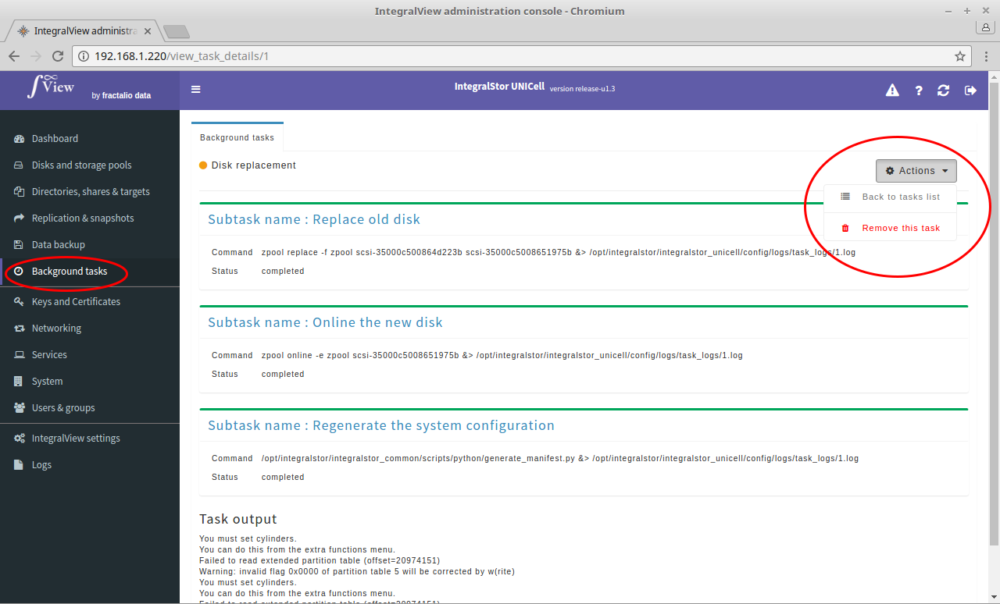

To remove a particular task: 

- Go the the screen that displays the details of the desired task([instructions](view_task_details.md))

- Click on the actions drop down and select the "**Remove this task**" option. You will be prompted with a confirmation screen before the task is removed.  
