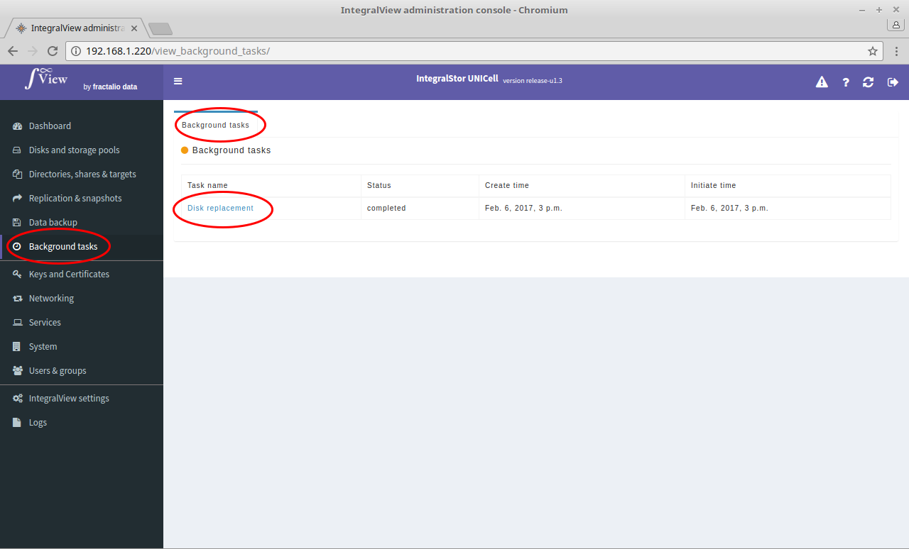

To view the details of a particular task: 

- Select the “**Background tasks**” main menu item on the left of the screen.

- Select the “**Background tasks**” sub menu tab.

- The list of background tasks present will be listed.

- Click on the name of the desired task to view the details.
