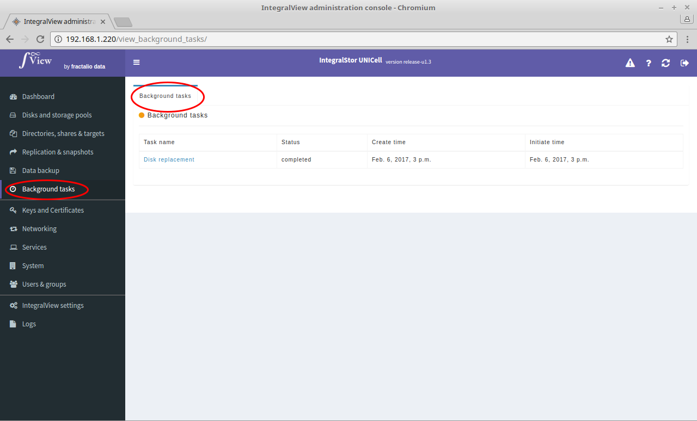

To view the list of currently present (either scheduled, running, failed or completed) background tasks :

- Select the “**Background tasks**” main menu item on the left of the screen.

- Select the “**Background tasks**” sub menu tab.

- The list of background tasks present will be listed.
