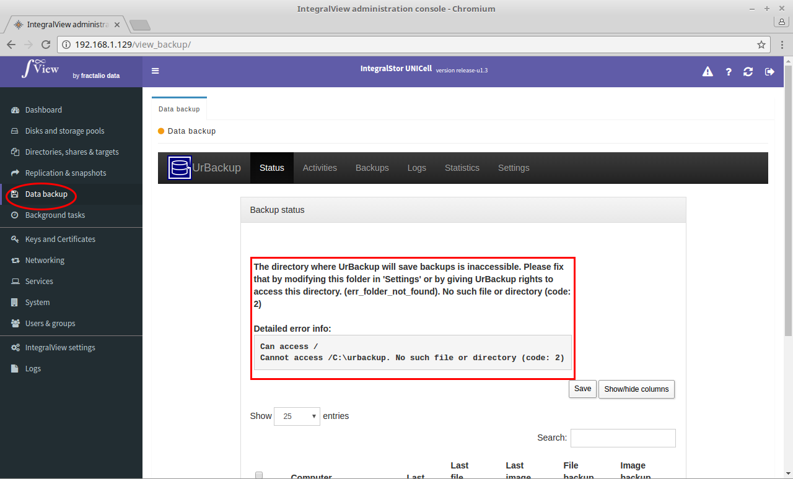

File and image backups from various client machines can be backed up onto the UNICell server. UNICell uses [UrBackup](https://www.urbackup.org) to administer this functionality. 

Here is a description of UrBackup from their website :

"UrBackup is an easy to setup Open Source client/server backup system, that through a combination of image and file backups accomplishes both data safety and a fast restoration time.

File and image backups are made while the system is running without interrupting current processes.

UrBackup also continuously watches folders you want backed up in order to quickly find differences to previous backups. Because of that, incremental file backups are really fast.

Your files can be restored through the web interface, via the client or the Windows Explorer while the backups of drive volumes can be restored with a bootable CD or USB-Stick (bare metal restore).

A web interface makes setting up your own backup server really easy. For a quick impression please look at the screenshots here.

Currently there are over 10,000 running UrBackup server instances (with auto-update enabled) with some instances having hundreds of active clients."

UNICell has integrated the UrBackup admin interface into IntegralView. To access this interface:

- Select the “**Data backup**” main menu item on the left of the screen.

- The UrBackup interface will then be loaded.

Detailed documentation on the usage of UrBackup is available on the [UrBackup documentation page](https://www.urbackup.org/documentation.html).
