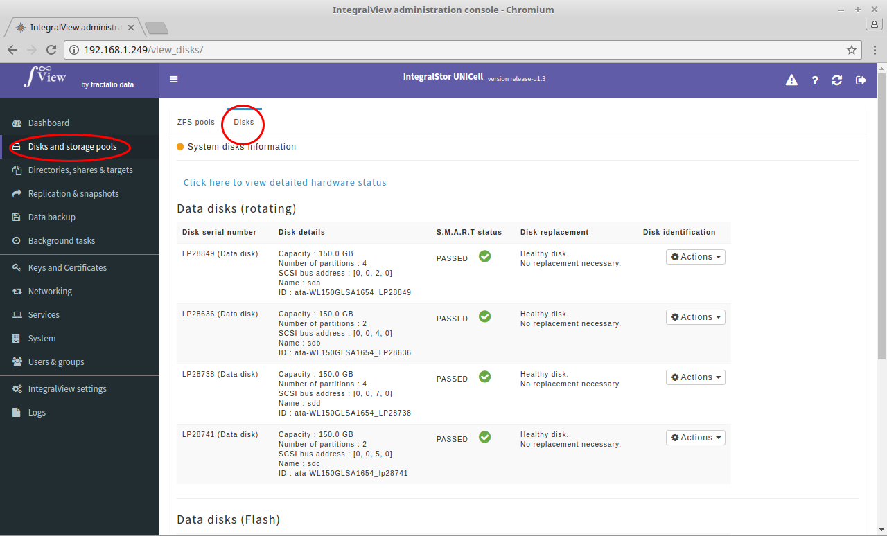

The UNICell system had a comprehensive disk information reporting, monitoring and replacement system. 

To view the list of disks that the system has recognized:

- Select the “**Disks and storage pools**” main menu item on the left of the screen.

- Select the “**Disks**” sub menu tab.

- Information about all the disks will be displayed.

This list is usually divided into three sections:

*Data disks(rotating) - This section lists all rotating data (non-OS) disks
*Data disks(Flash) - This section lists all non rotating data (non-OS) disks
*OS disks - The list of disks which conain the OS.

