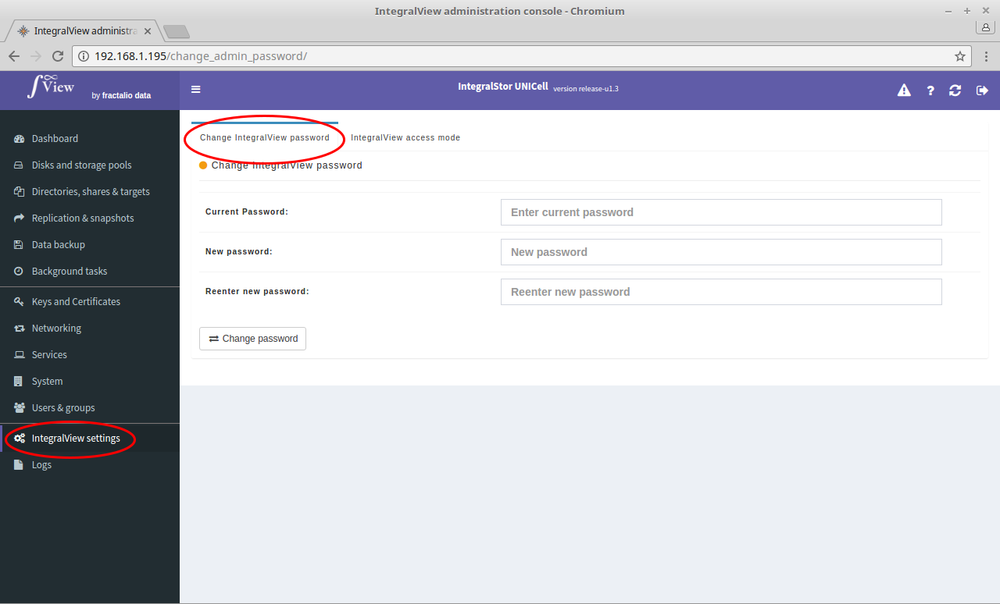

In order to change the IntegralView password:

- Select the “**IntegralView settings**” main menu item on the left of the screen.

- Select the “**Change IntegralView password**” sub menu tab.

You will be prompted for the current password, the new password and a confirmation of the new password before you can change the current password.
