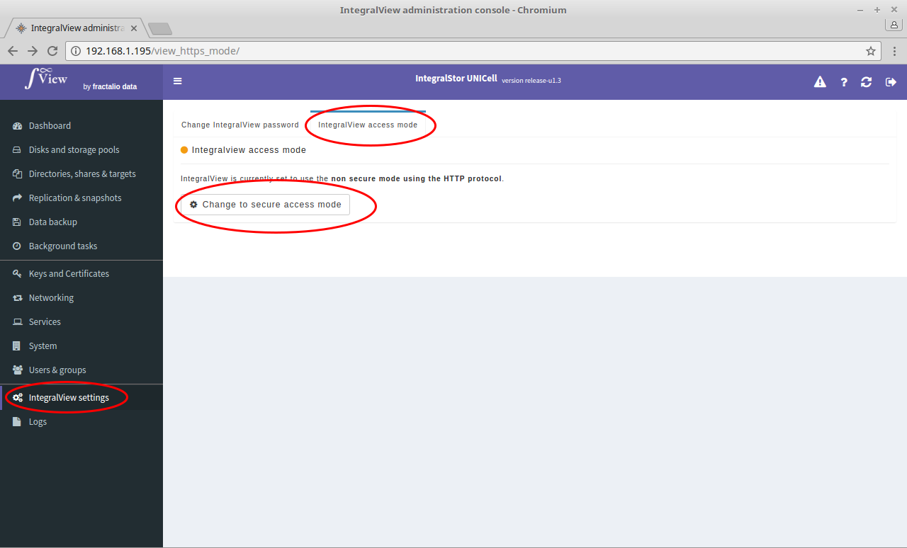

IntegralView can be accessed using two modes - a non-secure HTTP access mode or a secure HTTP access mode.

- Select the “**IntegralView settings**” main menu item on the left of the screen.

- Select the “**Change IntegralView access mode**” sub menu tab.

- In order to use the secure HTTPS mode, you will either need to have created a self signed certificate or uploaded a certificate onto the UNICell system (Instructions : ). Once that is done, clicking on the "Change to secure mode" button will prompt you to select the certificate to use before changing the access mode. 

** Please note that your current IntegralView access will be lost once you switch modes. You will need to use the https:// prefix for the secure mode or the http:// prefix for the non-secure mode to access IntegralView" **
