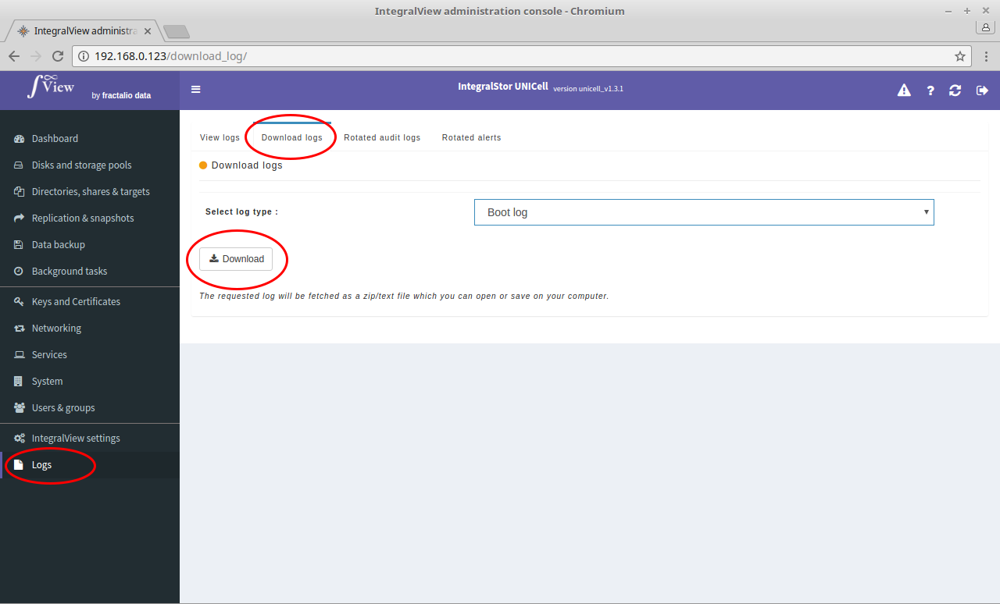

To download logs onto your computer:

- Select the “**Logs**” main menu item on the left of the screen.

- Select the “**Download logs**” sub menu tab.

- Select the type of log that you want to download from the drop down selector and click the "Download" button.

The selected log will then be downloaded onto your computer.

