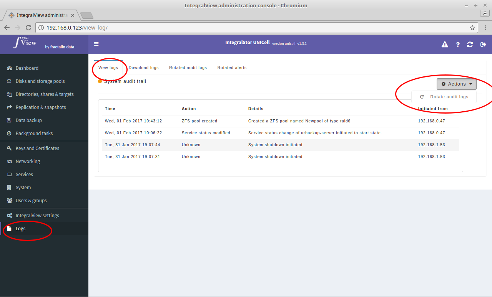

To rotate either the audit log or alerts log :

- Select the “**Logs**” main menu item on the left of the screen.

- Select the “**View logs**” sub menu tab.

- Select the type of log that you want to rotate from the drop down selector.

- Click on the Actions button and select the rotate action.

The selected log will then be rotated. The rotated logs can be viewed by clicking on either the “**Rotated audit logs**” or "Rotated alerts" sub menu tab.

