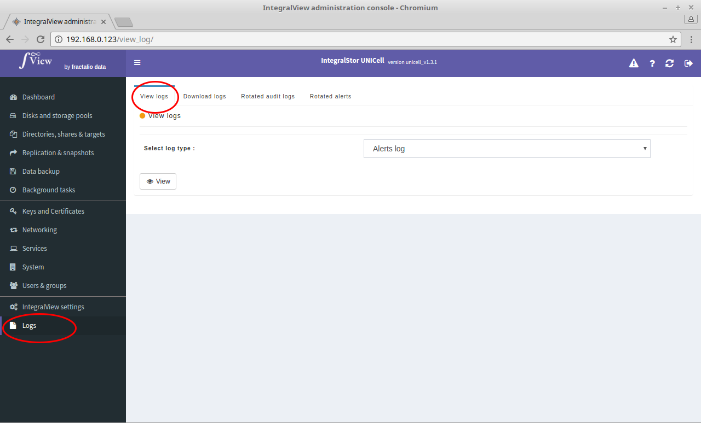

To view logs in your browser :

- Select the “**Logs**” main menu item on the left of the screen.

- Select the “**View logs**” sub menu tab.

- Select the type of log that you want to view from the drop down selector and click the "View" button.

The selected log will then be displayed.

