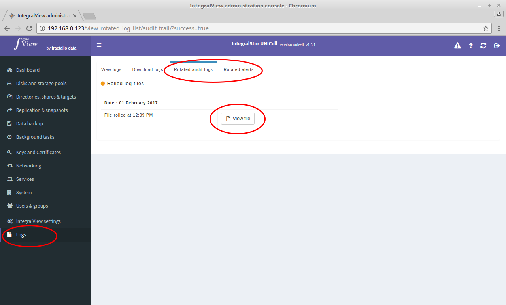

To view rotated logs in your browser :

- Select the “**Logs**” main menu item on the left of the screen.

- Select either the “**Rotated audit logs**” or the "**Rotated alerts**” sub menu tab.

- A list of previously rotated logs will be displayed. 

- Click on the "View file" button corresponding to the desired log to view that rotated log.

The selected rotated log will then be displayed.
