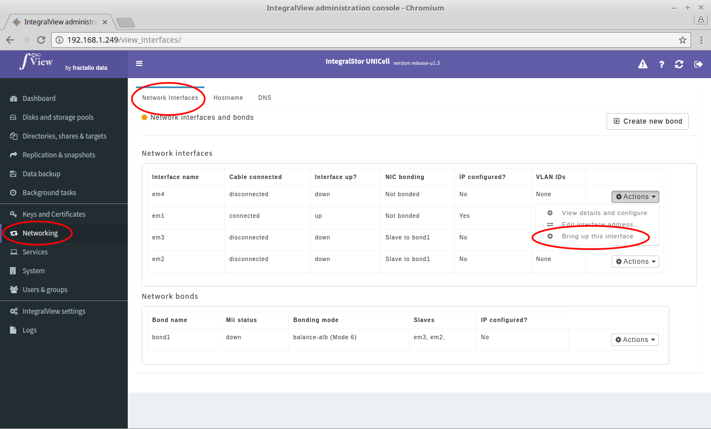

In order to change the state of an interface (bring it up or down):

- Go the the screen that displays all interfaces ([instructions](view_interfaces.md))

- Click on the "**Actions**" drop down selector corresponding to the desired interface and choose either the "**Bring up this interface**" or "**Bring down this interface**" selection.

If you are bring down an interface, you will be presented with a confirmation page before the action happens.
