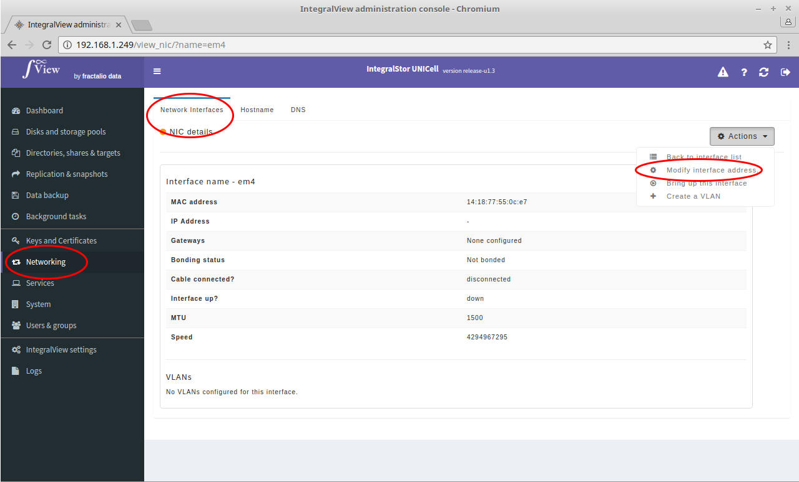
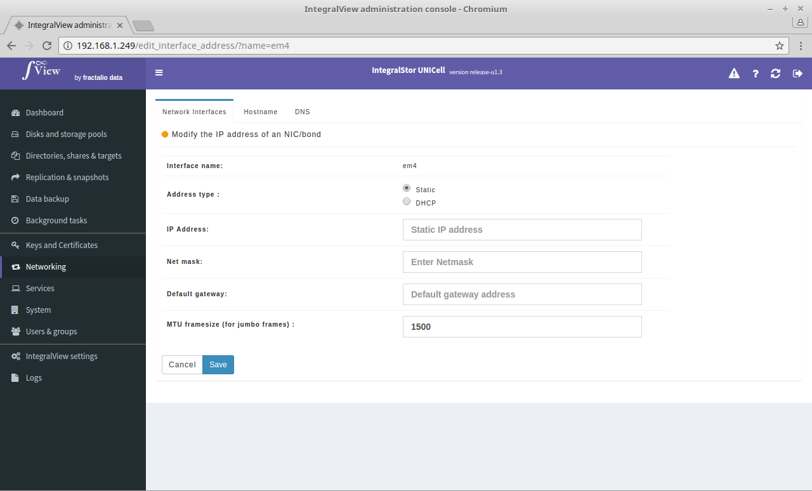

In order to configure the address for a network interface or bond :

- Go to the screen that displays the details of the desired interface or bond ([instructions](view_interface.md))

- Click on the "**Actions**" drop down selector and select the “**Modify interface address**” or "**Modify bond address**" selection. You will then be prompted for the following information in order to change the address :

**Address type** : A choice of DHCP or status is provided. It is recommended that you either provide a very long lease DHCP address or use a static IP address instead as this will prevent frequent address changes and data access disruptions

The following parameters are only enabled if you choose static.

**IP address** : The IPv4 address for this UNICell.

**Netmask** : Netmask in a dotted decimal format.

**Default gateway** : The default gateway for data flowing through this interface.

**MTU size** : Maximum transfer unit for jumbo frames.
