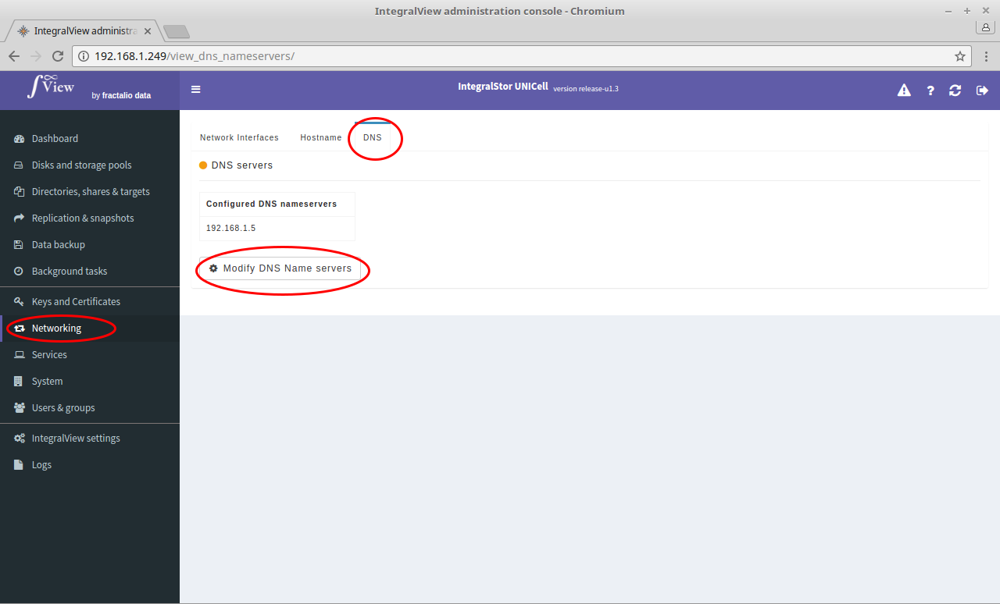
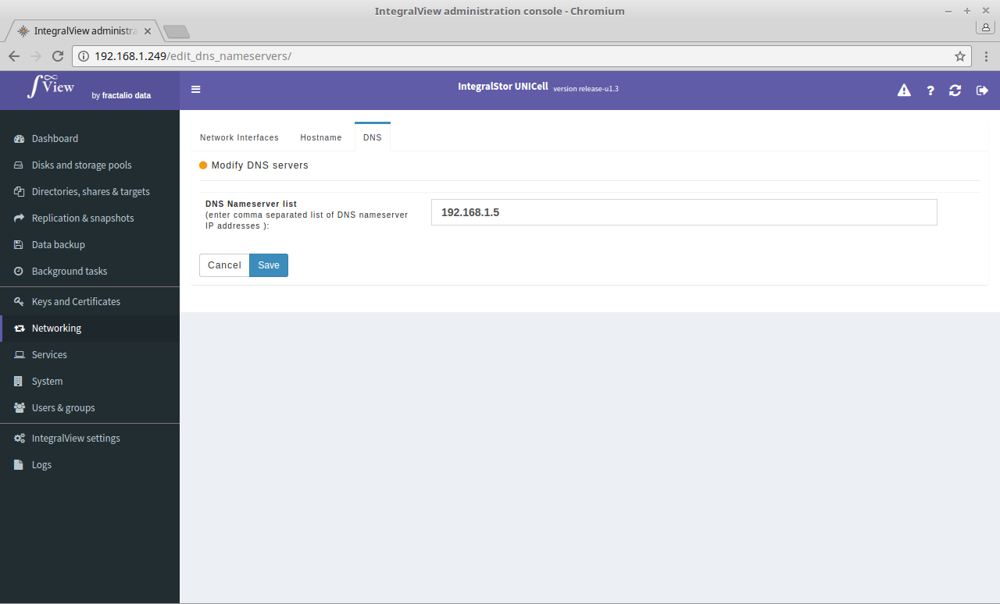

The UNICell system needs to have the correct DNS name servers configured in order for services such as CIFS AD authentication, email alerting, NTP to work correctly. Use this to configure the correct list of DNS name servers.

In order to view and configure the DNS name servers :

- Select the “**Networking**” main menu item on the left of the screen.

- Select the “**DNS**” sub menu tab.

- The list of currently configured DNS name servers is displayed.

- Click on the “**Modify DNS name servers**” to change the list of configured DNS servers. You will be prompted for either one or more (comma separated) IP address(es) of the DNS name servers.

