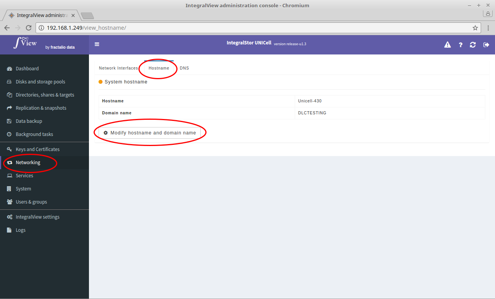
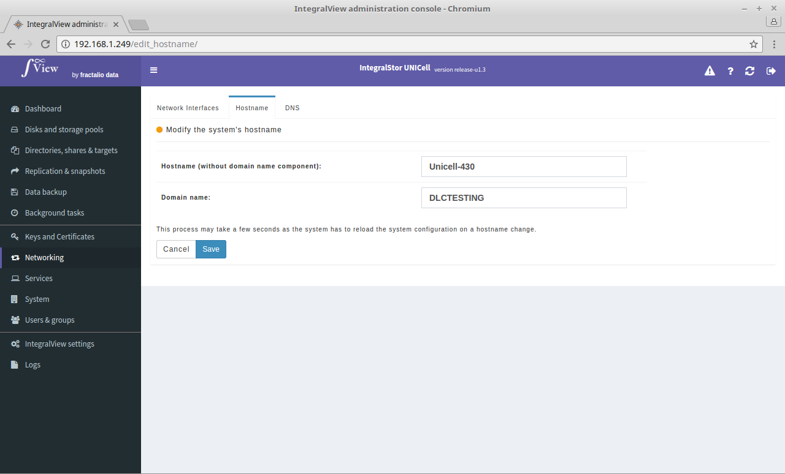

In order to view and configure the hostname and domain name of the UNICell system :

- Select the “**Networking**” main menu item on the left of the screen.

- Select the “**Hostname**” sub menu tab.

- This displays the current hostname and domain name.

- Click on the “**Modify hostname and domain name**” button to change the hostname and domain name of the UNICell system.

You will be prompted for the following information :

**Hostname (without domain name component)** : Enter only the hostname component here

**Doamin name** : Enter only the domain name component here.

