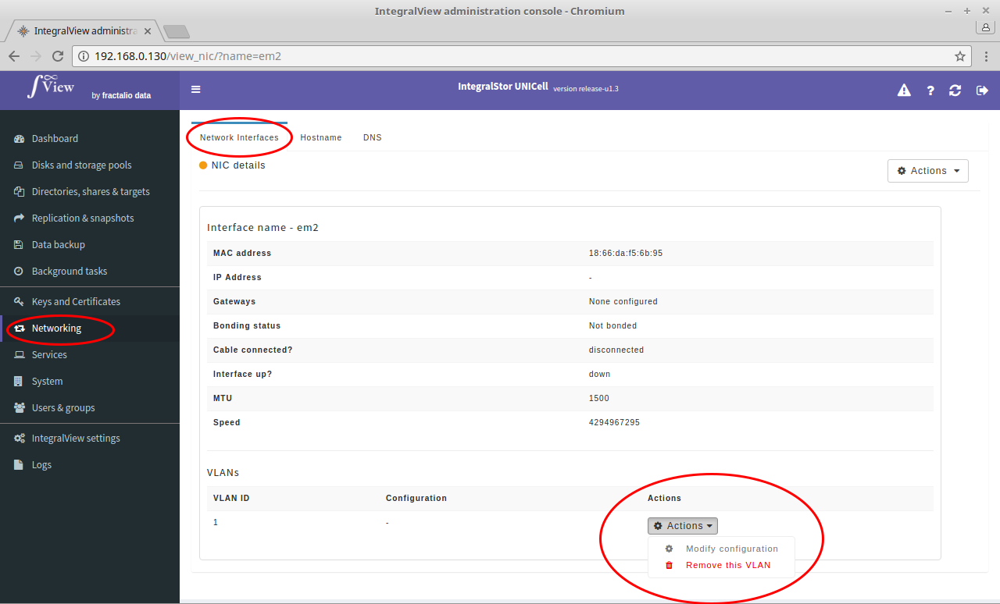

- Go the the screen that displays the desired interface details ([instructions](view_interface.md))
- Click on the "**Actions**" dropdown next to the desired VLAN.
- Select the "**Modify configuration**" option to set the address for this VLAN.

