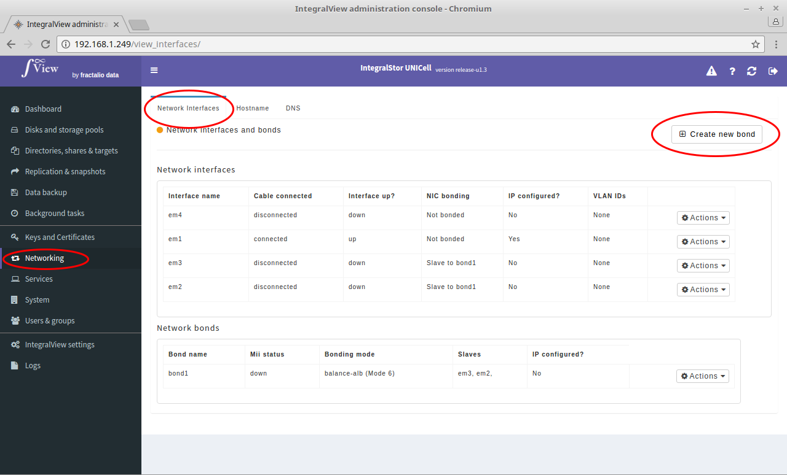
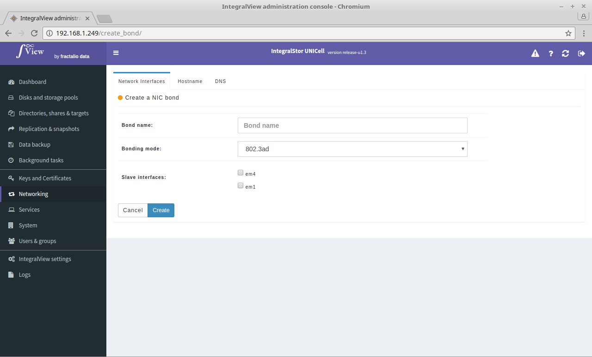

In order to create a network bond :

- Go the the screen that displays all interfaces ([instructions](view_interfaces.md))

- Click on the "**Create new bond**" button.

You will then be taken to the screen shown above and prompted for the following information needed to create a bond :

**Bond name** : A name for the bond being created.

**Bonding mode** : The UNICell system supports two modes of bonding – 802.3ad(mode 4) or balance-alb (mode 6). Please note that 802.3ad needs support and configuration on the switch side as well.

**Slave interfaces** : Select the interfaces that you want to include as part of this bond. Only those interfaces that are not already a part of another bond will be displayed here.

