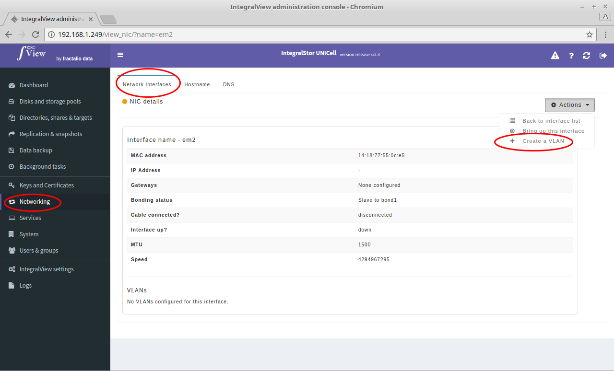
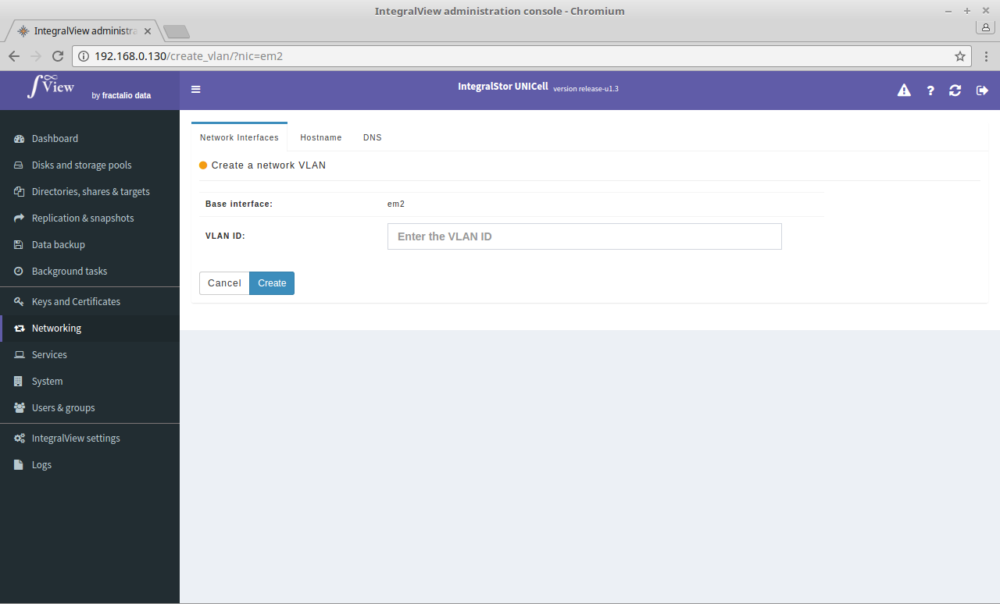

In order to create a VLAN :

- Go the the screen that displays the desired interface details ([instructions](view_interface.md))

- Click on the "**Actions**" dropdown and select the "**Create VLAN**" option.

- You will be taken to a screen like the one below where you need to enter a VLAN ID and create the VLAN. 

