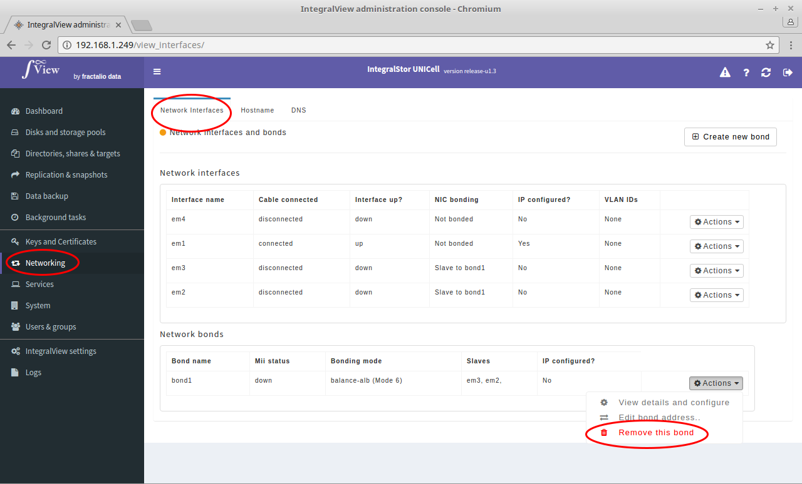

In order to remove a network bond :

- Go the the screen that displays all interfaces ([instructions](view_interfaces.md))

- Click on the "**Actions**" drop down selector corresponding to the desired bond and choose the "**Remove this bond**" selection.

You will be presented with a confirmation page before the actual bond removal happens.
