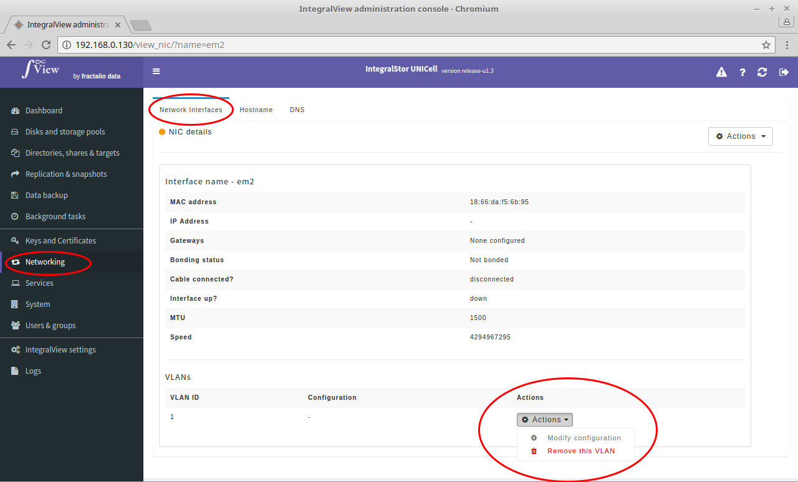

- Go the the screen that displays the desired interface details ([instructions](view_interface.md))
- Click on the "**Actions**" dropdown next to the desired VLAN.
- Select the "**Remove this VLAN**" option 
- You will be prompted for a confirmation before this VLAN is removed. 

