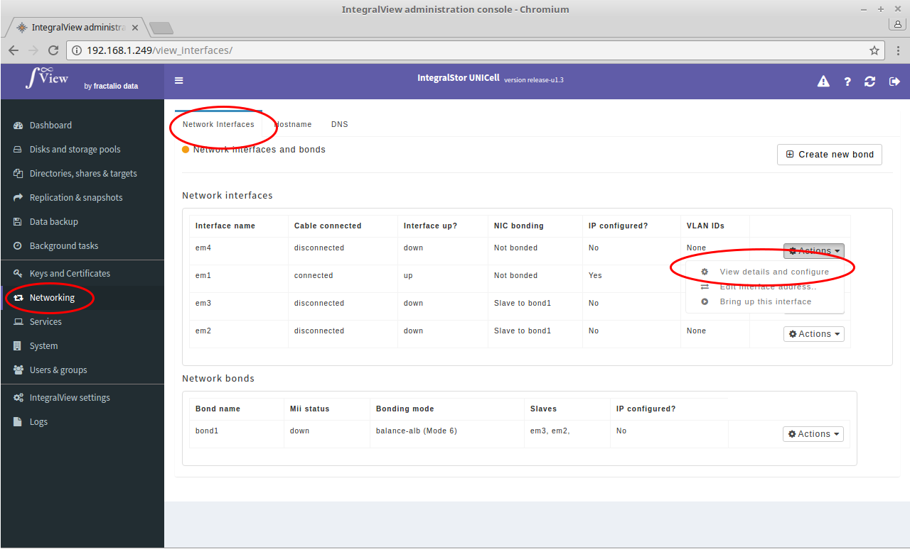
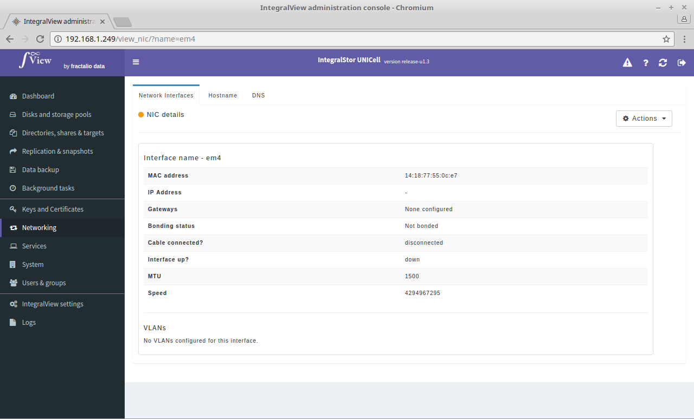
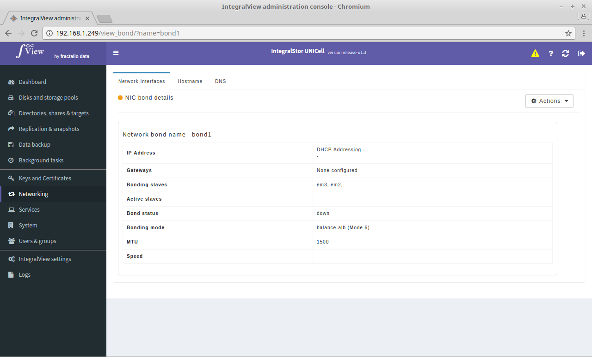

In order to view the details of an individual network interface or network bond :

- Select the “**Networking**” main menu item on the left of the screen.

- Select the “**Network interfaces**” sub menu tab.

- The list of interfaces present along with a list of configured network interface bonds will be listed

- Click the "Action" drop down for the desired interface and bond and select the "View details and configure"

This will take you to the screen that provides you details of this interface/bond and allows you to configure it.

*Above: Network interface details*

*Above: Network bond details*
