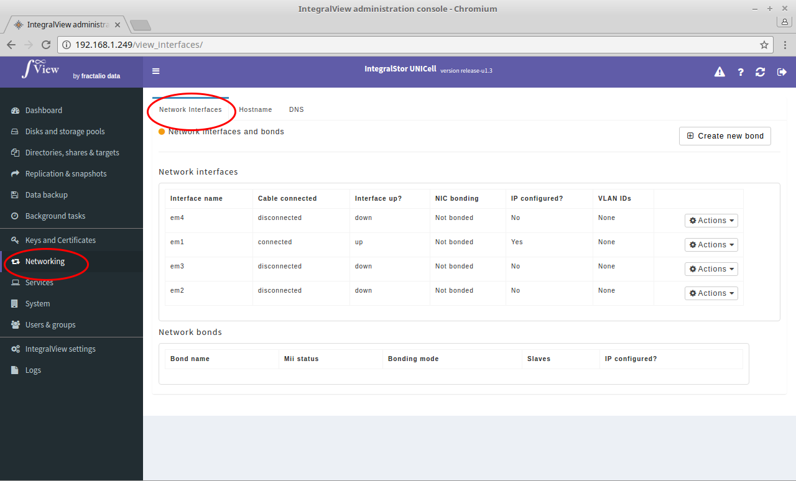

In order to view all the network interfaces and network bonds :

- Select the “**Networking**” main menu item on the left of the screen.

- Select the “**Network interfaces**” sub menu tab.

- The list of interfaces present along with a list of configured network interface bonds will be listed
