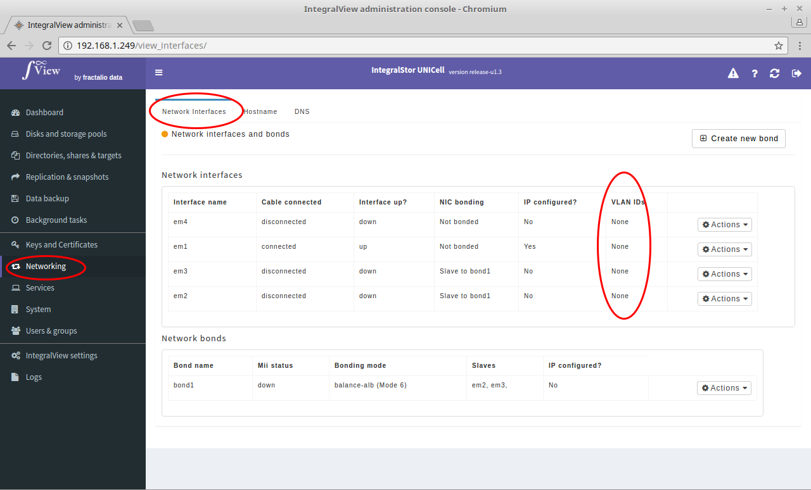

In order to view the VLANS for an interface:

- Go the the screen that displays all interfaces ([instructions](view_interfaces.md))

- The column called VLAN IDs corresponding to the desired interface gives the list of created VLANs.

You can also see this information by viewing the details of the specific interface. ([instructions](view_interface.md))

