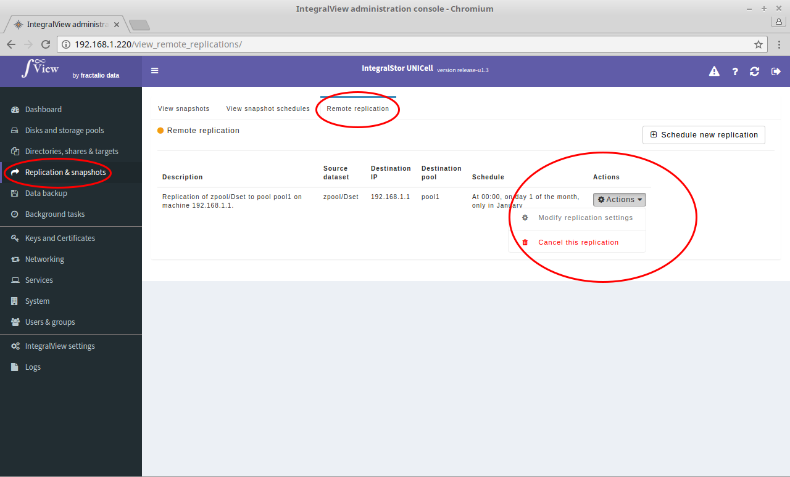

To cancel the schedule of an already scheduled remote replication:

- Go the the screen that displays the list of remote replications ([instructions](view_remote_replications.md))

- Click on the "**Actions**" dropdown corresponding to the desired remote replication and select "**Cancel this replication**".

- This will take you to a confirmation screen before the replication is cancelled.

