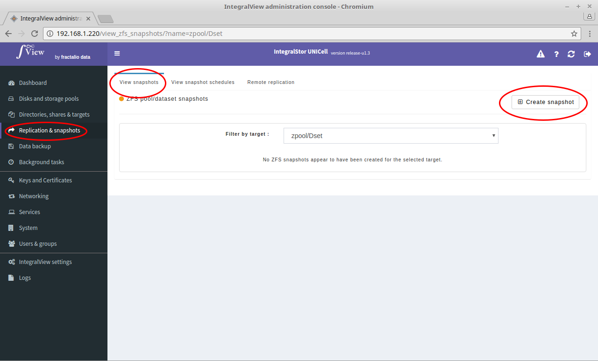
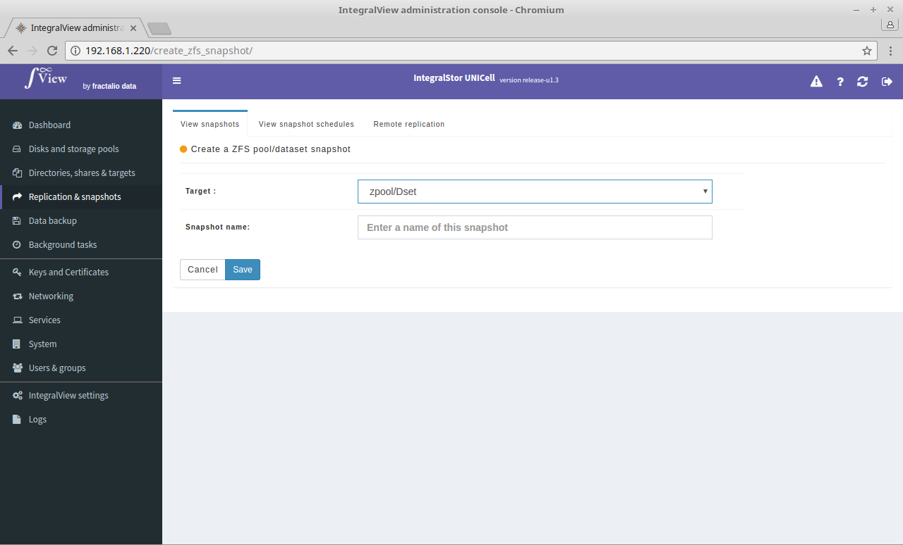

To manually create a new snapshot:

- Go the the screen that displays the list of snapshots ([instructions](view_snapshots.md))

- Click on the "**Create snapshot**" button.

You will be presented with the screen below where you will need to select the target for which the snapshot is desired and a name for the desired snapshot before the snapshot is created.

