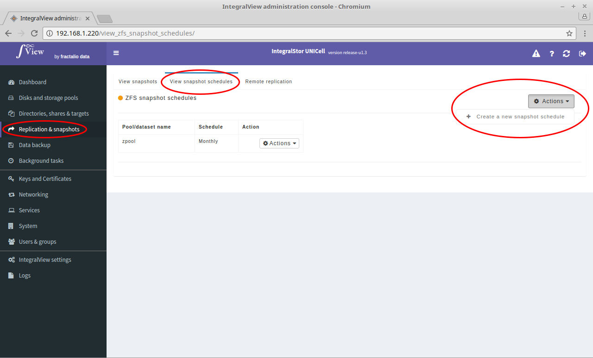
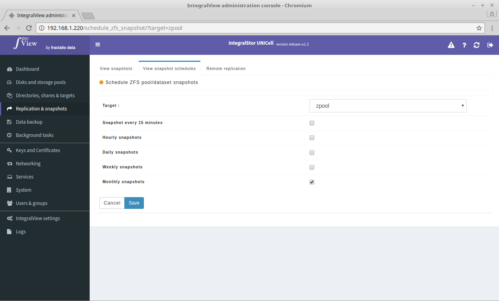

To create a new snapshot schedule:

- Go the the screen that displays the snapshot schedules ([instructions](view_snapshot_schedules.md))

- Click on the "**Actions**" dropdown and select "**Create a new snapshot schedule**".

- You will be taken to the screen below where you can select the schedule.

