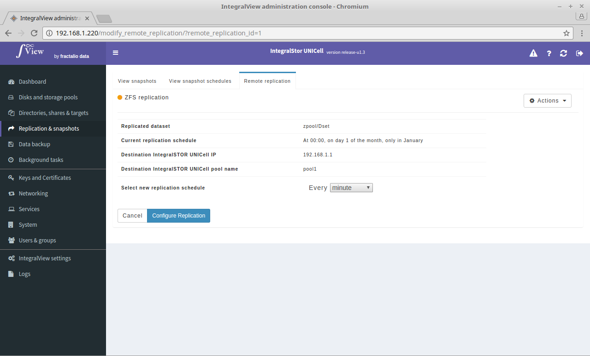

To modify the schedule of an already scheduled remote replication:

- Go the the screen that displays the list of remote replications ([instructions](view_remote_replications.md))

- Click on the "**Actions**" dropdown corresponding to the desired remote replication and select "**Modify replication settings**".

- This will take you to the screen below where you can change the schedule of the replication. 

