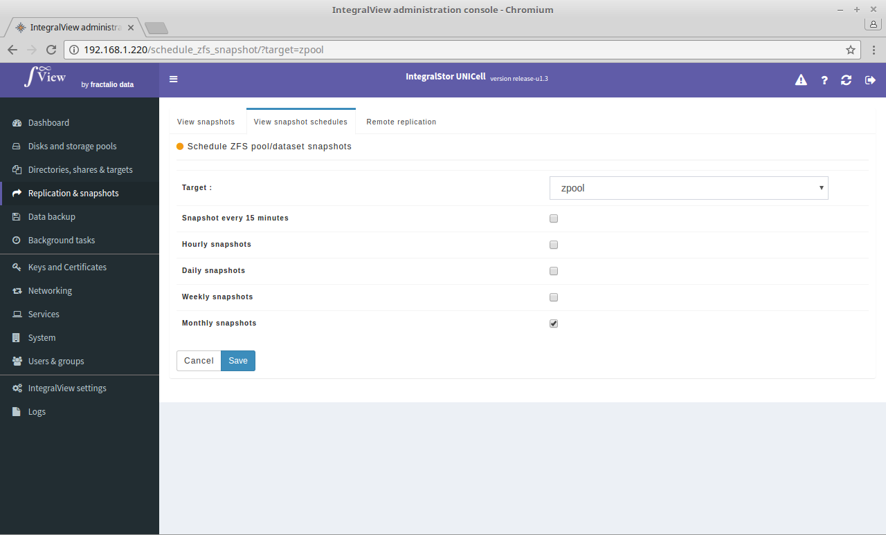

To modify or cancel an already created snapshot schedule :

- Go the the screen that displays the list of snapshot schedules ([instructions](view_snapshot_schedules.md))

- Click on the "**Actions**" dropdown corresponding to the desired snapshot schedule.

- You will be taken to the screen below where you can check/un-check any of the schedules.

