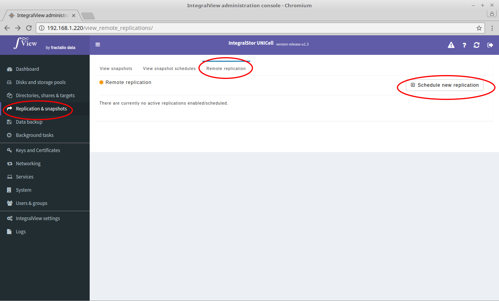
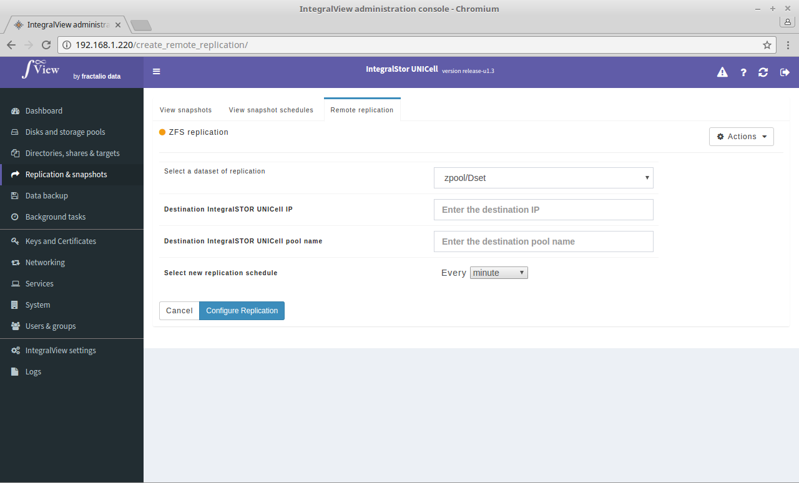

To schedule a new remote replication:

- Go the the screen that displays the list of remote replications ([instructions](view_remote_replications.md))

- Click on the "**Schedule new replication**" button.

- This will take you to the screen below. You will need to choose the source dataset, the IP address of the destination UNICell, the pool name on the remote UNICell which will receive this replicated dataset and the schedule.

