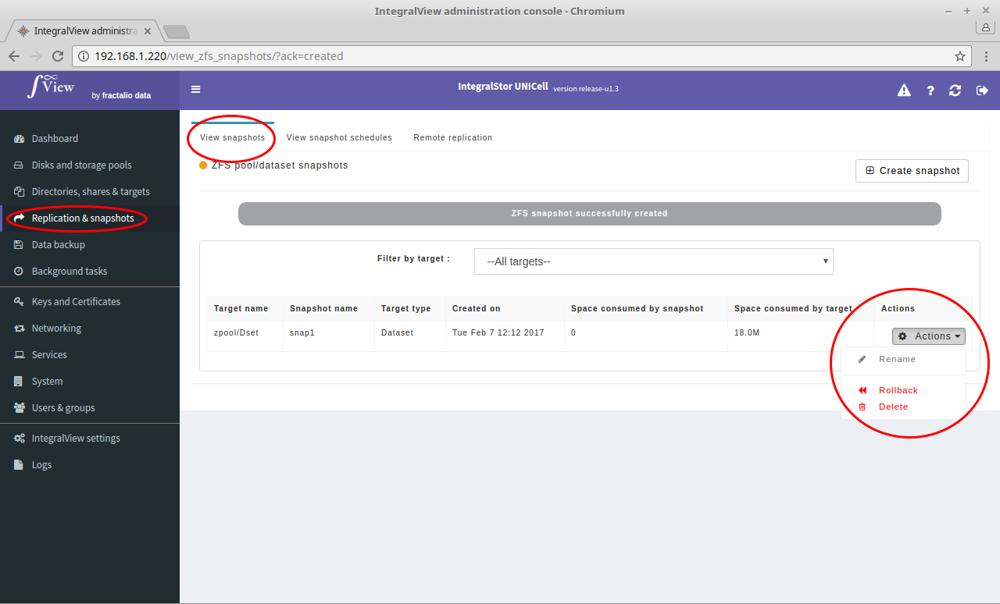

The UNICell system allows you to rename, delete or roll back to a particular snapshot.

Before deleting/rolling back to a snapshot, you will be prompted for a confirmation as these operation involve the potential loss of data.

A note from the ZFS documentation about rolling back to a snapshot :
A note about these ZFS snapshots from [Aaron Topence's ZFS guide](https://pthree.org/2012/12/19/zfs-administration-part-xii-snapshots-and-clones/) follows..

*"An important thing to know, is if a snapshot exists, it's considered a child filesystem to the dataset. As such, you cannot remove a dataset until all snapshots, and nested datasets have been destroyed."

*“Rolling back to a previous snapshot will discard any data changes between that snapshot and the current time. Further, by default, you can only rollback to the most recent snapshot. In order to rollback to an earlier snapshot, you must destroy all snapshots between the current time and that snapshot you wish to rollback to. If that's not enough, the filesystem must be unmounted before the rollback can begin. This means downtime.”*

- Go the the screen that displays the list of snapshots ([instructions](view_snapshots.md))

- For the desired snapshot, click on the "**Actions**" button and select the desired snapshot operation.

