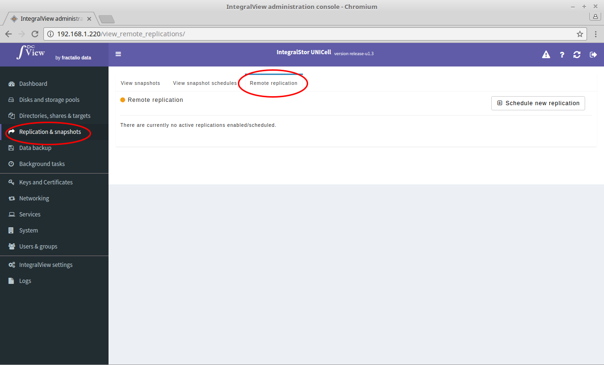

Remote replication of a dataset from one UNICell to a ZFS pool in another UNICell can be scheduled. To view the currently scheduled remote replications:

- Select the “**Replication and snapshots**” main menu item on the left of the screen.

- Select the “**Remote replication**” sub menu tab.

- The list of scheduled remote replications will be listed.

