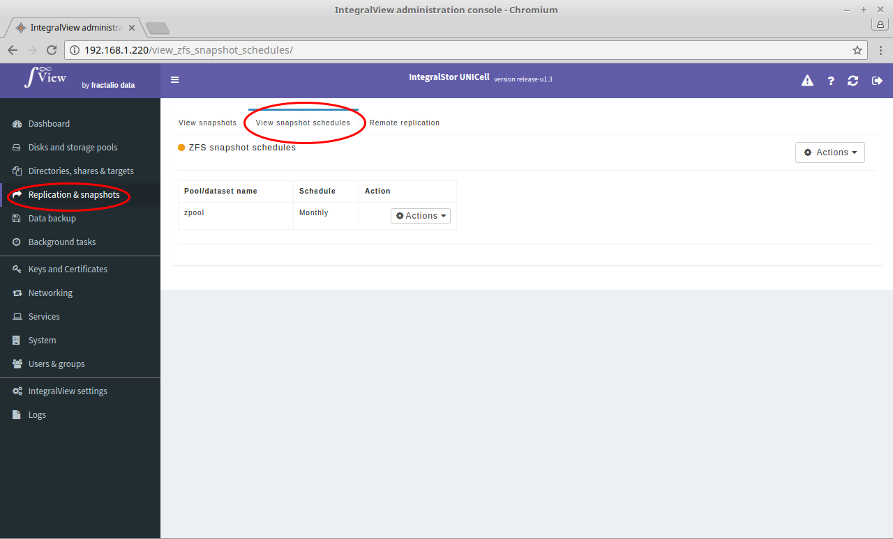

Creation of snapshots can be scheduled in the UNICell system. Scheduled snapshots are also automatically pruned in order to avoid unnecessary old snapshots from accumalating. The snapshots can be scheduled for the following frequencies :

* Every 15 minutes (only the last 4 of these snapshots will be preserved)
* Hourly (only the last 24 of these snapshots will be preserved)
* Daily (only the last 365 of these snapshots will be preserved)
* Weekly (only the last 52 of these snapshots will be preserved)
* Monthly (only the last 12 of these snapshots will be preserved)

To view the current snapshot creation schedules:

- Select the “**Replication and snapshots**” main menu item on the left of the screen.

- Select the “**View snapshot schedules**” sub menu tab.

- The list of snapshot schedules will be listed.
