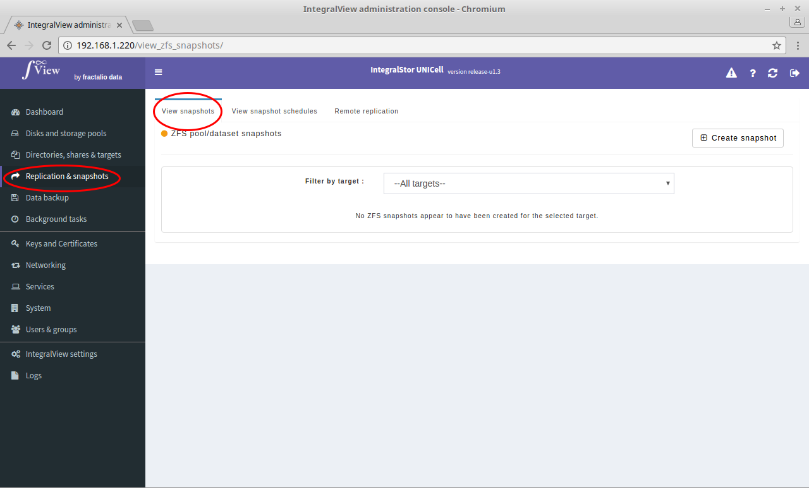

To view the list of created snapshots:

- Select the “**Replication and snapshots**” main menu item on the left of the screen.

- Select the “**View snapshots**” sub menu tab.

- The list of snapshot created will be listed.

- You can filter these snapshots by the target by selecting the target from the dropdown menu.
