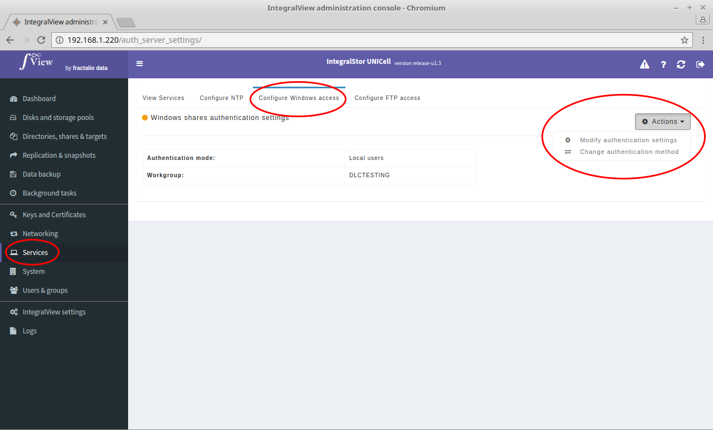
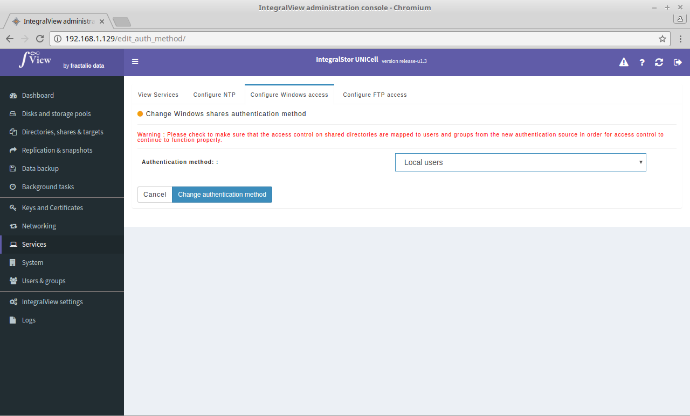
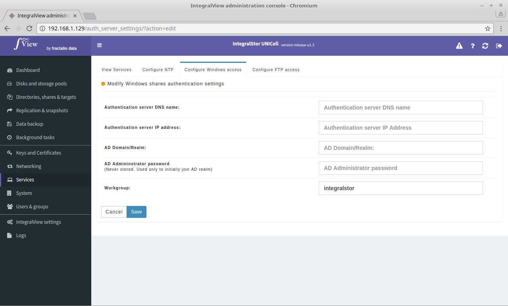
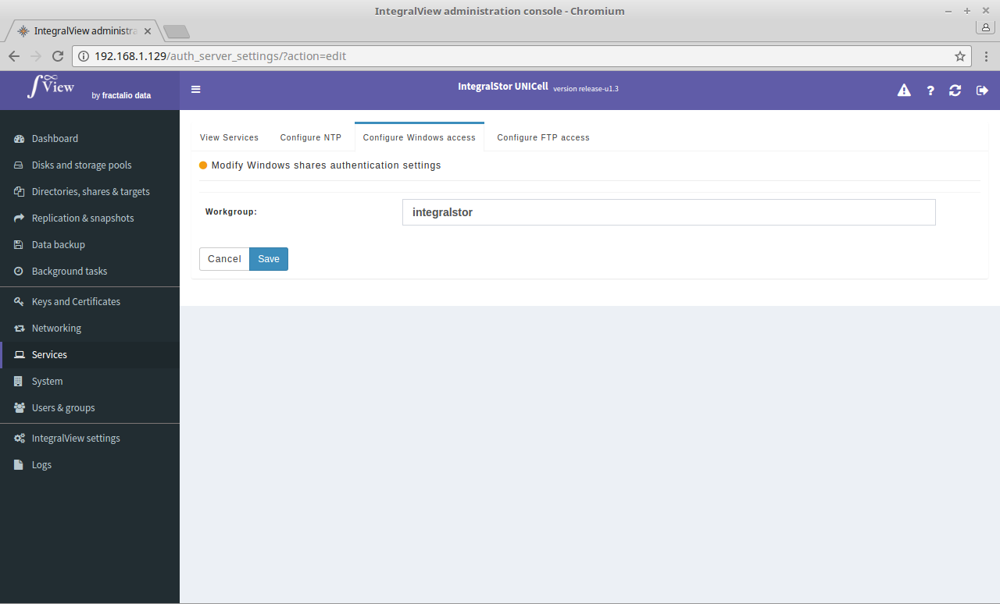

##Introduction

Before you can create and use Windows shares, you should first configure the Windows access service.

UNICell currently supports two methods of authentication for Windows shares – Active Directory and local user/groups. Before you can create shares, please select one of these methods of authentication.

##Viewing the current configuration

To view the current authentication method :

- Select the “**Services**” main menu item on the left of the screen.

- Select the “**Configure Windows access**” sub menu tab.

This screen will display the current authentication method and other details.

##Modifying the authentication method

To change the authentication method :

- Click on the "**Actions**" dropdown and select “**Change authentication method**” 

- This will allow you to change the authentication method. Once you select the authentication method, you will be taken to a screen that allows you to select the required parameters for that particular mode of authentication. **Please note that changing the authentication method will result in the current access control being lost for all currently existing shares.**

##Modifying authentication settings

To change the authentication settings but retain the current authentication method :

- Click on the "**Actions**" dropdown and select “**Change authentication settings**” 

You will be taken to a screen that allows you to select the required parameters for that particular mode of authentication. 

##Configuring Active Directory (AD) authentication for Windows shares

*Before you configure Active Directory authentication, please ensure that you add the Active Directory server's IP to the DNS name servers list (described in the Networking section).*

- Select the “**Services**” main menu item on the left of the screen.

- Select the “**Configure Windows access**” sub menu tab.

- Make sure that the current authentication method is set to Active Directory. If not, click on the “**Actions**” drop down to change the authentication method. This will then take you to a screen that allows you to configure the settings for the Active Directory authentication server.

The required parameters for this are :

**Authentication server DNS name** : The DNS name of your Active Directory Server. Please note that you will need to configure UNICell's DNS server settings to add your Active Directory's DNS NAME and IP address otherwise authentication will fail.

**Authentication server IP address** : The IP address of the Active Directory server.

**AD Domain/Realm** : The Doman name of your Active Directory domain.

**AD Admininstrator password** : Enter the administrator password of your Active Directory server. This is required for the UNICell storage server to join the Active Directory domain in order to query and authenticate against it. This password is never stored in the UNICell server. It is only used for the initial join.

**Workgroup** : The workgroup of your Active Directory server

Once this information is entered and saved, the UNICell server will then attempt to join the Active Directory domain of your Active Directory server. If this process is successful, then when you try to create a new Windows share, you should see the users and groups from Active Directory being displayed in that screen.

## Configuring Local User authentication for Windows shares

If Active Directory authentication is not the preferred option, UNICell also supports authentication based on local users and groups created on the UNICell system itself. These local users and groups can be created using IntegralView (refer to the section about local users and groups in this manual).

To configure local user based authentication :

- Select the “**Services**” main menu item on the left of the screen.

- Select the “**Configure Windows access**” sub menu tab.

- Make sure that the current authentication method is set to Local Users. If not, click on the “**Actions**” drop down to change the authentication method. 

On selecting this, you will be taken to a screen which prompts for the workgroup in use in your network. Enter the workgroup and save.
