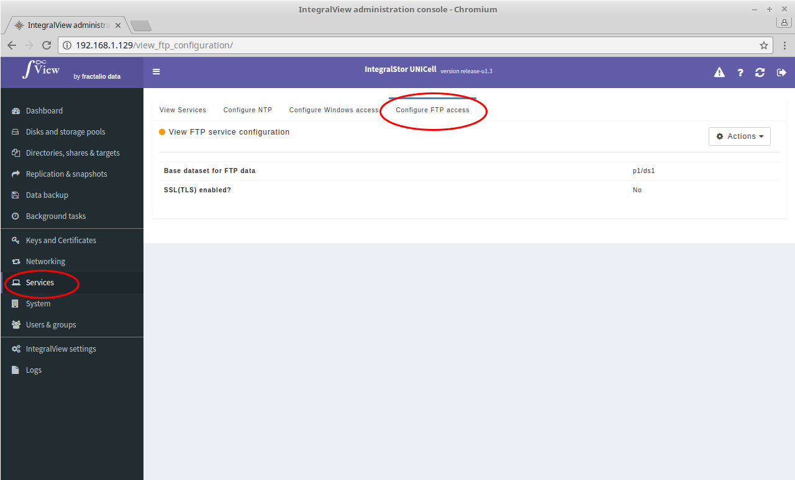
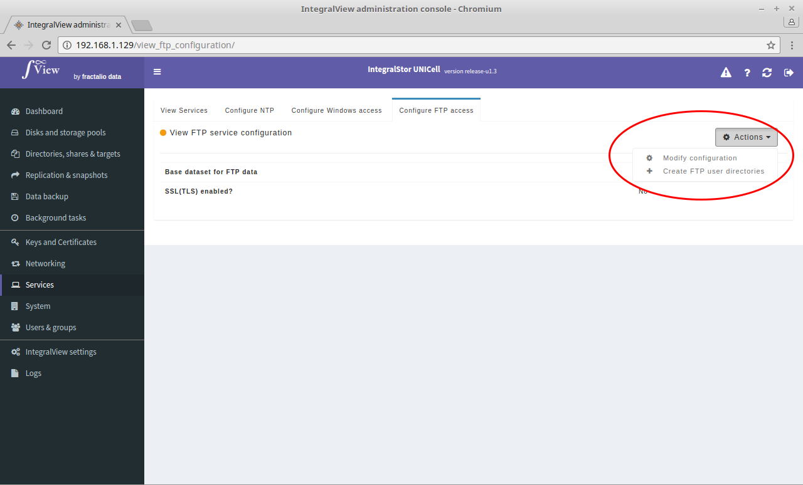
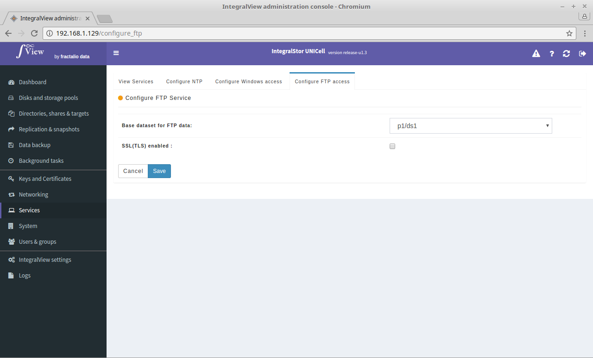

The UNICell server can also serve as an FTP server. UNICell uses vsftpd. Vsftpd is an open source FTP server. It is an extremely secure, stable and fast FTP server used by many high traffic sites on the Internet.

##Viewing the current FTP configuration

To view the current FTP method :

- Select the “**Services**” main menu item on the left of the screen.

- Select the “**Configure FTP access**” sub menu tab.

This screen will display the current configuration.

##Modifying the FTP configuration

To modify the current FTP method :

*Please note that you need to have created at least one dataset that can be used as the FTP destination/source before configuring FTP.*

- Select the “**Services**” main menu item on the left of the screen.

- Select the “**Configure FTP access**” sub menu tab.

- Click on the "**Actions**" dropdown and select the "**Modify configuration**" option.

- You will be taken to the screen below where you need to enter the dataset in which FTP data will reside. You can also configure FTP to use secure SSL(TLS) connections. If you choose this option, you will need to select the SSL certificate to use.

##Configuring user FTP access

Any local user account that has been created on the UNICell system can access the FTP server but before that, user directories have to be created within the dataset that has been earmarked for FTP data.

In order to create user directories for all existing local users on the UNICell system :

*Please note that you every time you add a new local user, you will need to perform this step in order to provide that user with FTP access*

- Select the “**Services**” main menu item on the left of the screen.

- Select the “**Configure FTP access**” sub menu tab.

- Click on the "**Actions**" dropdown and select the "**Create FTP user directories**" option. This will result in subdirectories getting created under the designated FTP dataset with appropriate permissions.

