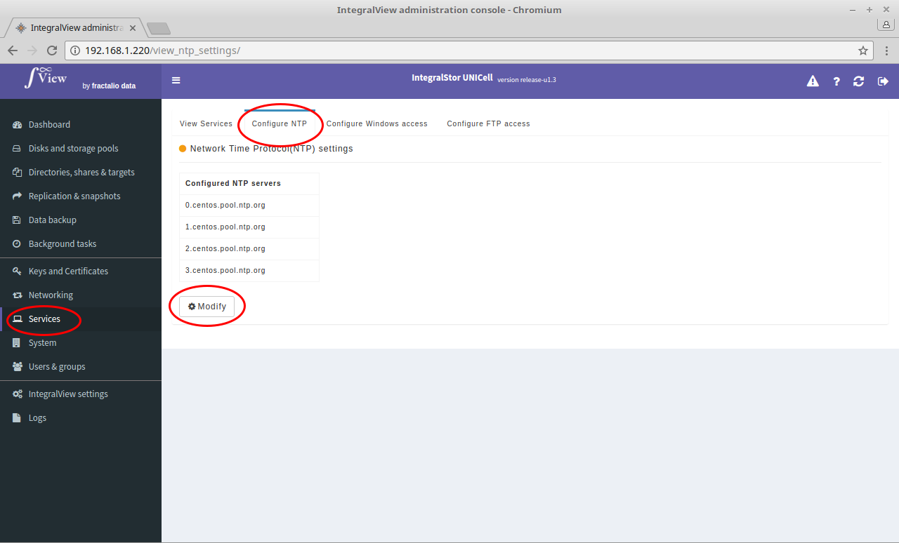
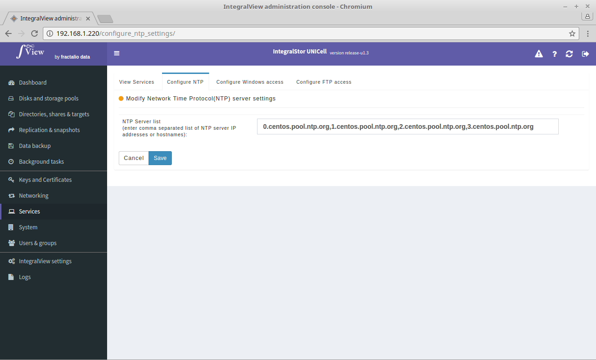

The NTP service is used to synchronize the time on the UNICell system to another server. This is particularly important in the case of Active Directory authentication as a time lag between the active directory server and the UNiCell server may result in a failure in authentication.

To view the current NTP configuration:

- Select the “**Services**” main menu item on the left of the screen.

- Select the “**Configure NTP**” sub menu tab.

- If you have already configured the NTP service, the current configuration will be displayed. 

To modify the current NTP configuration:

- Click on the “**Modify**” button to change the settings. You will see a screen similar to the one below

- If you have not configured the NTP service before then click on the “**Configure NTP settings**” button.

In either case, you will be prompted for the following information :

**NTP server list** : Enter comma separated list of NTP server IP addresses or hostnames. If you enter hostnames, then please configure a DNS name server on UNICell which can resolve this hostname. 

