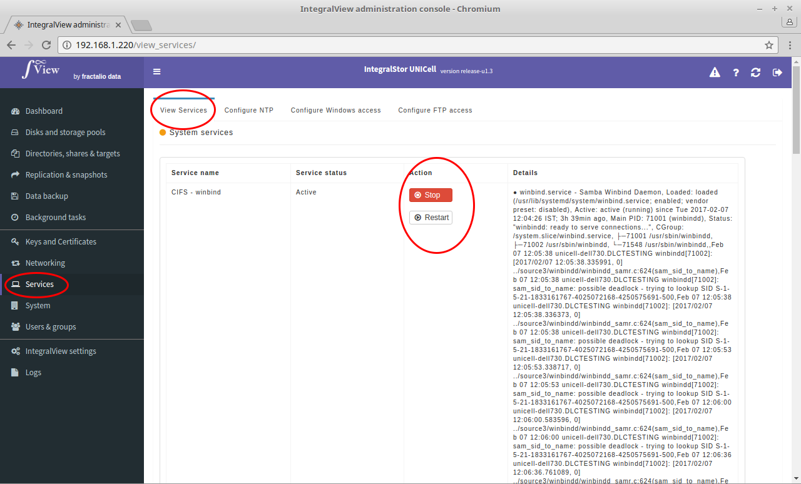

The status of various system services can be viewed and controlled using this option. Please use this very carefully as stopping a system service may result in an outage in data access to users.

- Select the “**Services**” main menu item on the left of the screen.

- Select the “**View services**” sub menu tab.

- This will display a list of system services with its current status. Use either the “**Start**”, “**Stop**” or "**Restart**" in the Actions column to change the status of a particular service.
