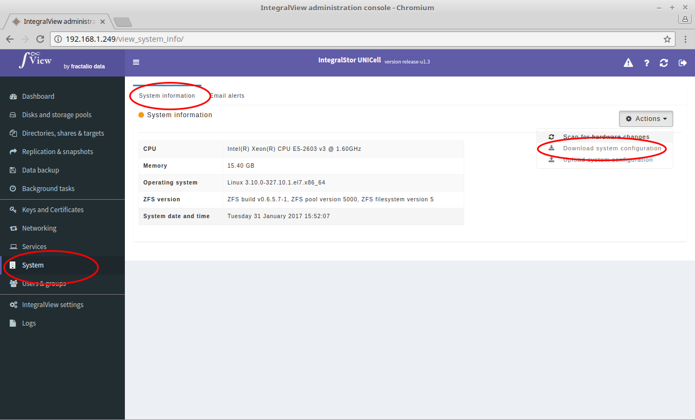

If there is an issue that the support personel need to examine, use this option to download the complete information about the system.

- Select the “**System**” main menu item on the left of the screen.

- Select the “**System information**” sub menu tab

- Click on the “**Download system configuration**” button

- This results in all the system configuration files and log files being downloaded in one compressed file.
