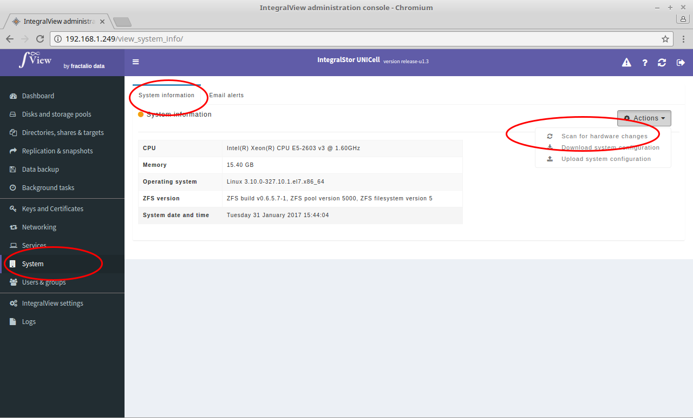

If there is a change in hardware configuration (for example, addition of memory, hard disks, etc), this option can be used to scan the system for the current hardware configuration.

- Select the “**System**” main menu item on the left of the screen.

- Select the “**System information**” sub menu tab.

- Select the “**Scan for hardware changes**” option in the Actions dropdown.

- This will then scan the system and display the discovered configuration. If you find the new configuration acceptable then you can then save this as the new master configuration.
