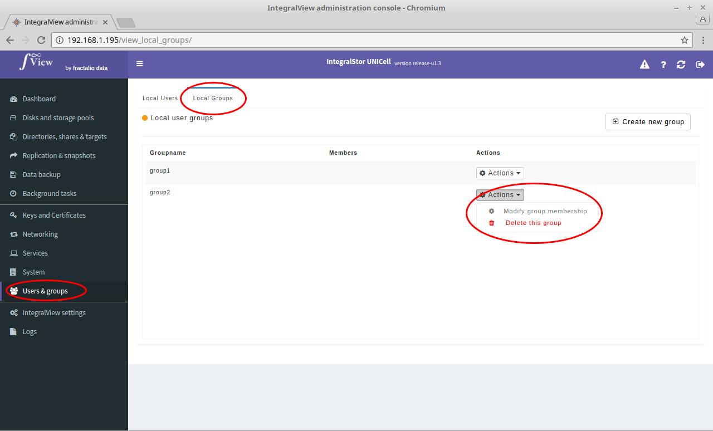

To add/remove users from a particular group :

- Go to the screen to view all local groups ([instructions](viewing_users_groups.md))

- Click on the “**Actions**” selector corresponding to the desired group and select "**Modify group membership**".

- You will be taken to the screen below where you can select/remove the desired users for membership in the selected group. 

