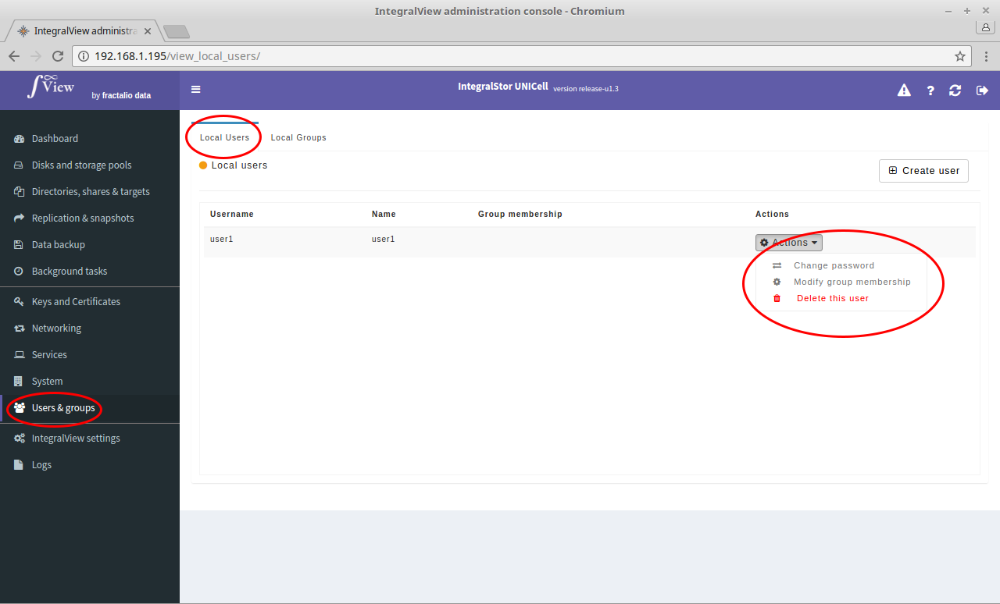

All local users belong to a system group called "integralstor". In addition, they can be assigned to other groups as well. To modify/set a local user's additional group membership :

- Go to the screen to view all local users ([instructions](viewing_users_groups.md))

- Click on the “**Actions**” selector corresponding to the desired user and select "**Modify group membership**".

- You will be taken to the screen below where you can select/remove the desired groups for membership. 

