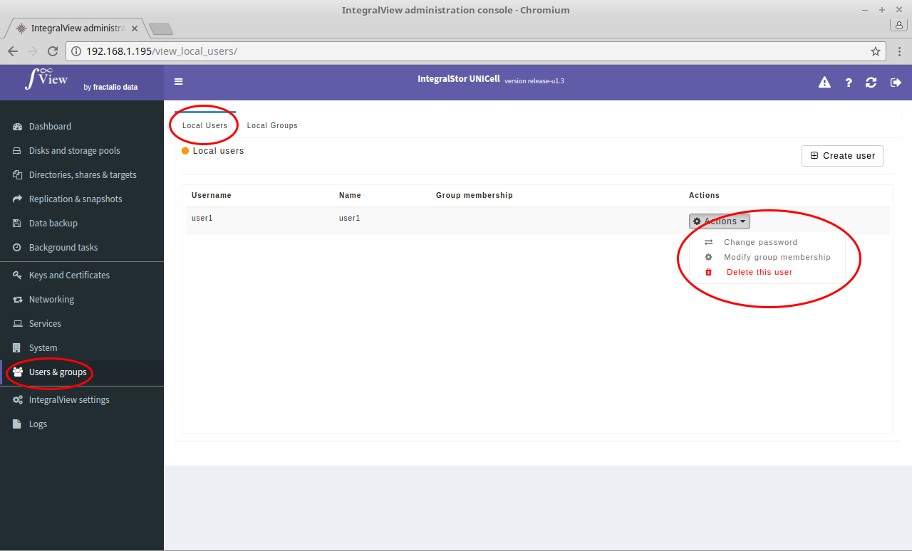
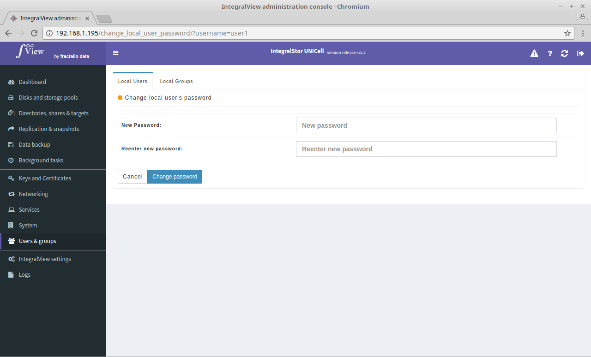

To change the password of a local user :

- Go to the screen to view all local users ([instructions](viewing_users_groups.md))

- Click on the “**Actions**” selector corresponding to the desired user and select "Change password".

- You will be taken to the screen shown below where you need to enter and confirm the new password in order to change the user's password.

