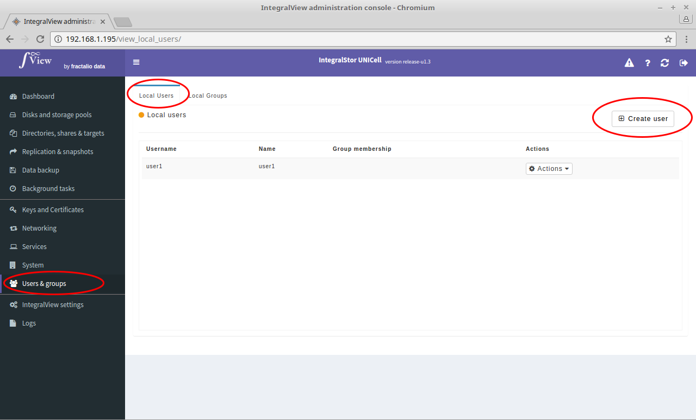
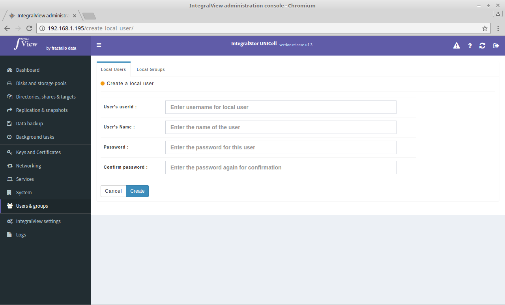
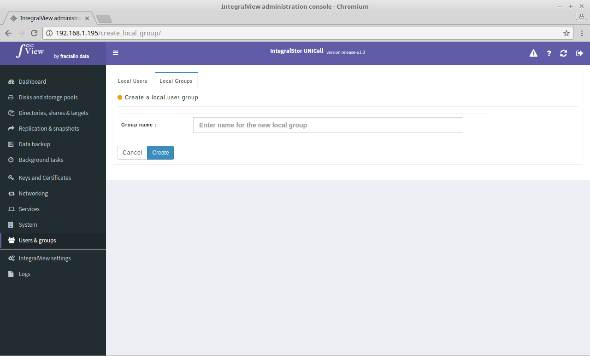

To create a new local user or group :

- Go to the screen to view all local users or groups ([instructions](viewing_users_groups.md))

- Click on the “**Create user**” or "**Create group**" button on the top right.

- For creating a user, you will be prompted for the userid, user name and the password before the user is created (see below).

- For creating a group, you will be taken to the screen below and prompted for the group name(see below).

- After you save, you will be taken to the screen which will allow you to change/set the group's membership ([instructions](change_group_users.md))

