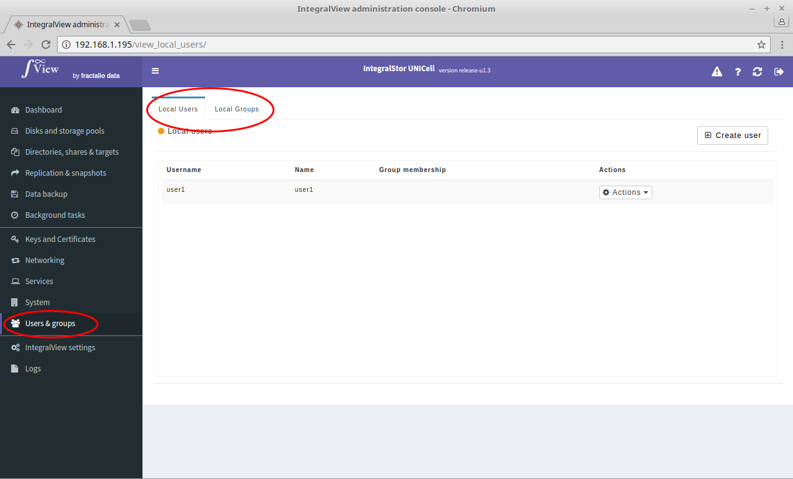

To view the existing local users and groups :

- Select the “**Users and groups**” main menu item on the left of the screen.

- Select the “**Local users**” sub menu tab to view the existing local users.

- Select the “**Local groups**” sub menu tab to view the existing local groups.
